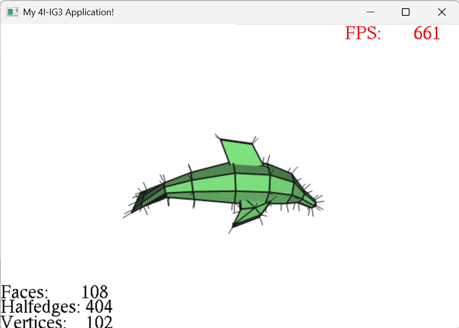
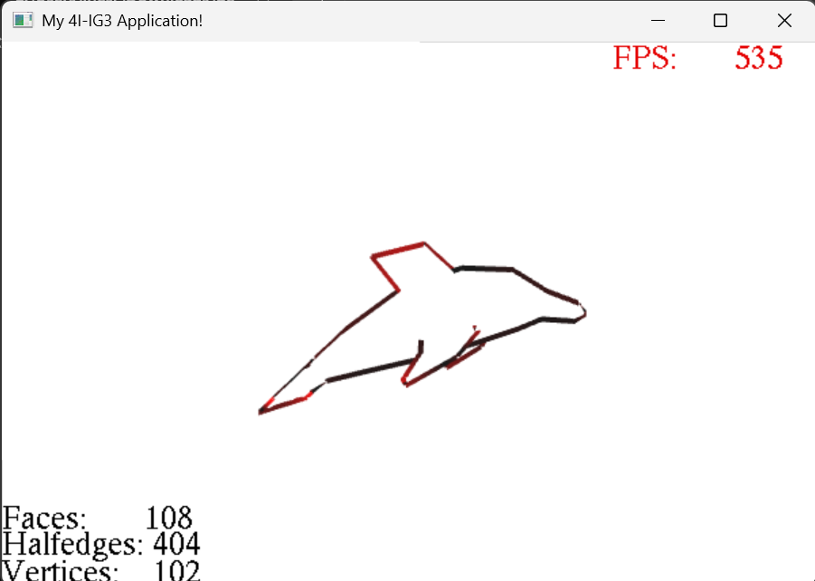
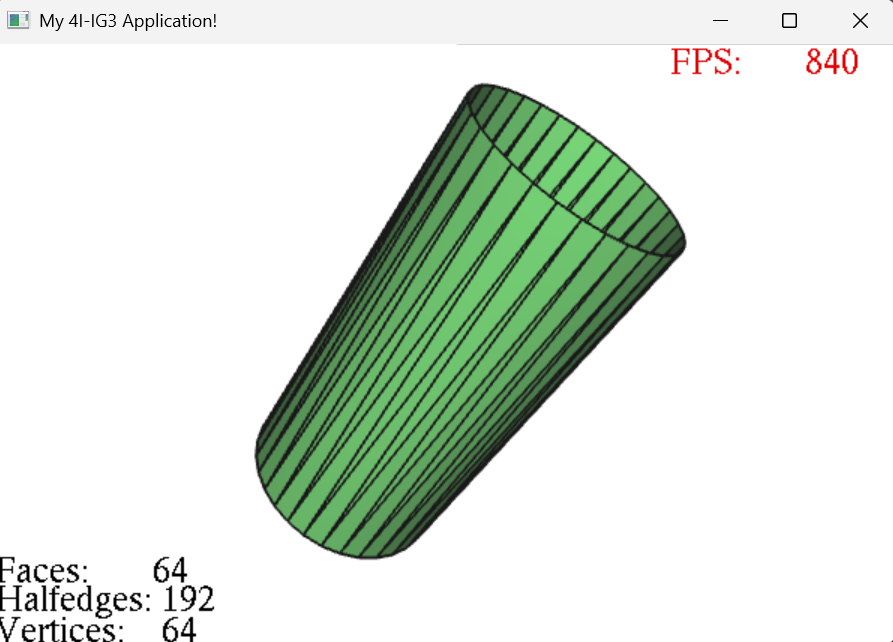
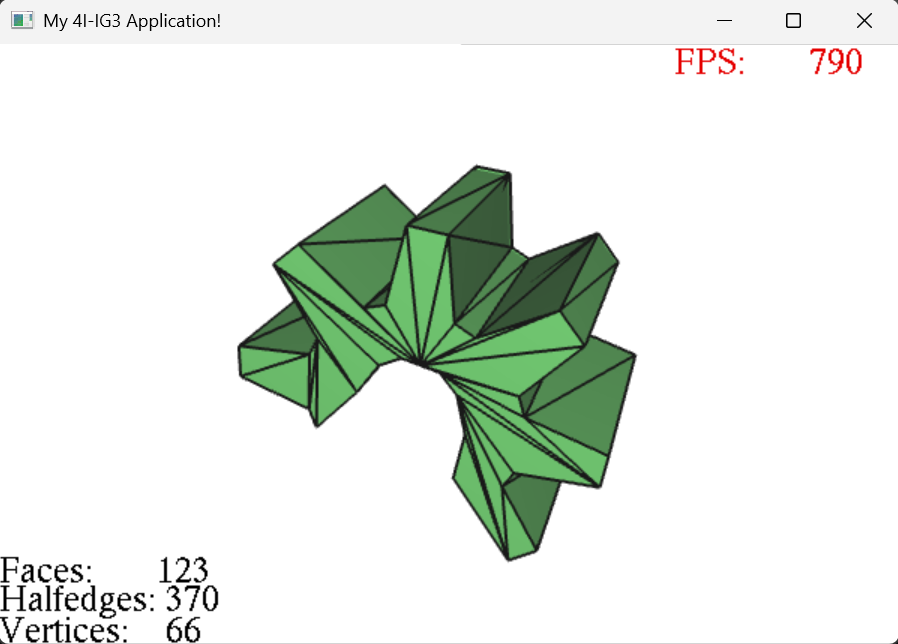
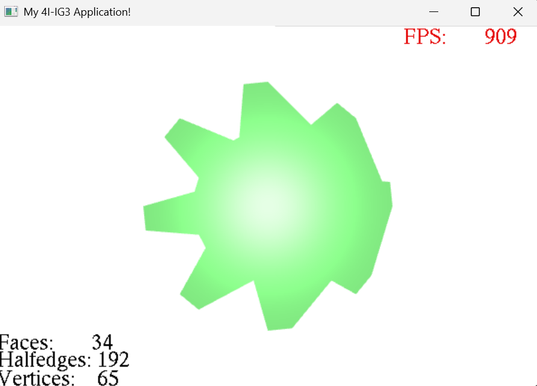
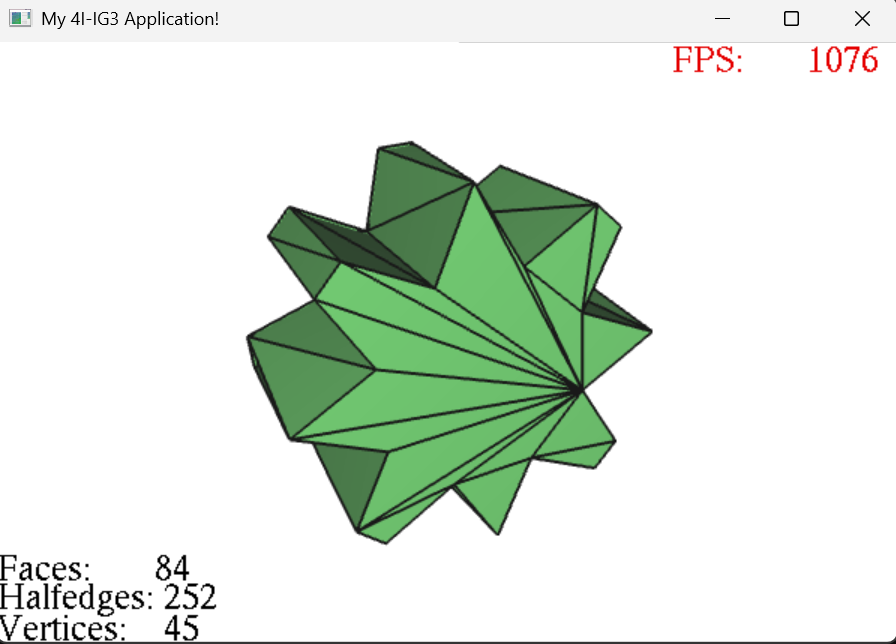

# Project Mesh – README

## Overview

This project implements a half-edge mesh structure for advanced 3D surface manipulation:

- loading OBJ files
- computing normals
- polygon triangulation
- parametric surface generation
- Catmull-Clark subdivision
- mesh simplification
- local operations (split edge / face)

---

## General Structure

The mesh relies on 4 main structures:

- `myVertex` – vertex (position + link to an incident half-edge)
- `myHalfedge` – half-edge (mesh topology)
- `myFace` – polygonal face
- `myPoint3D` – 3D point (x, y, z coordinates used to represent positions and normals)

---

## File Loading

```cpp
bool myMesh::readFile(std::string filename)
```

**Role:** Loads an `.obj` file and builds the half-edge mesh.

**How it works:**
- Reading vertices (`v`)
- Reading faces (`f`)
- Creating half-edges
- Building links: `next` / `prev`, `twin` (via map), `source`, `adjacent_face`
- Building vertices and faces

**Notes:**
- Automatic twin management
- Polygon support

---

## Normals

```cpp
void computeNormals()
```

**Role:** Computes normals for faces and vertices (averaged from adjacent faces).

**Steps:**
- Each face computes its own normal
- Each vertex accumulates normals from adjacent faces



```cpp
void myFace::computeNormal()
```

**Role:** Computes the normal of a triangular or polygonal face.

**Method:** Cross product: `(p2 - p1) x (p3 - p1)`

---

## Silhouette Rendering

```cpp
MENU_DRAWSILHOUETTE
````

**Role:** Implements silhouette extraction and rendering of the mesh based on view-dependent edge detection.

**Steps:**

- Iterates over all half-edges of the mesh
- For each edge, compares the orientation of its two adjacent face normals relative to the camera view direction
- Computes dot products between face normals and the view vector
- Detects silhouette edges when one face is visible (dot > 0) and the other is hidden (dot ≤ 0)
- Stores selected edges in a temporary buffer
- Renders these edges in red using OpenGL line primitives

  
--

## Mesh Verification

```cpp
verifyHalfEdgeStructure()
```

**Role:** Verifies global consistency:
- Pointer existence
- `next` / `prev` consistency
- `twin` consistency
- Face contour consistency
- Vertex validation

```cpp
checkMesh()
```

**Role:** Checks whether all half-edges have a twin.

---

## Normalization

```cpp
normalize()
```

**Role:** Centers and scales the mesh into a unit cube.

**Steps:**
- Bounding box computation
- Centering
- Uniform scaling

---

## Split Edge (local operation)

```cpp
splitEdge(myHalfedge* e1, myPoint3D* p)
```

**Role:** Divides an edge in two by inserting a new vertex.

**Steps:**
- Creating a new vertex
- Creating new half-edges
- Rewiring adjacent faces
- Updating twins and sources

---

## Split Face (triangles / quads)

```cpp
splitFaceTRIS(myFace* f, myPoint3D* p)
```

**Role:** Splits a face into triangles around a central point.

```cpp
splitFaceQUADS(myFace* f, myPoint3D* p)
```

**Role:** Splits a face into quads around a center point.

---

## Revolution Surface

```cpp
generateRevolutionMesh(profile, slices)
```

**Role:** Generates a 3D surface by rotating a 2D profile.

**Steps:**
- Creating vertices by rotation
- Generating faces between rings
- Quad triangulation
- Creating half-edges and twins

  
---

## Triangulation

```cpp
triangulate()
```

**Role:** Triangulates all faces of the mesh.

```cpp
triangulate(myFace* f)
```

**Role:** Triangulates a polygonal face using ear clipping.

**Steps:**
- Normal computation (Newell method)
- Ear detection
- Progressive vertex removal
- Diagonal creation

  
---

## Catmull-Clark Subdivision

```cpp
subdivisionCatmullClark()
```

**Role:** Smooth subdivision of the mesh.

**Steps:**

- **Face points:** average of each face's vertices
- **Edge points:** average of `(v1 + v2 + f1 + f2) / 4`
- **Vertex points:** Catmull-Clark formula: `(F + 2R + (n-3)P) / n`
- **Reconstruction:** creation of new quad faces, full half-edge rebuild, twin recomputation

  
---

## Mesh Simplification

```cpp
simplifyShortestEdgeCollapse(int iterations)
```

**Role:** Reduces the number of triangles.

**Steps:**
- Finding the shortest valid edge
- Topological test (`canCollapse`)
- Collapse

```cpp
canCollapse(myHalfedge* h)
```

**Role:** Checks whether an edge can be removed without breaking topology.

**Checks:**
- No vertex duplication
- No dangerous flip
- No non-manifold collapse

```cpp
collapseEdge(myHalfedge* h)
```

**Role:** Merges two vertices and removes adjacent faces.

**Steps:**
- Vertex displacement
- Half-edge reassignment
- Removal of faces, edges, and vertex
- Memory cleanup

  
---

## Utility Functions

```cpp
edgeLength(myHalfedge* h)
```

Returns the distance between two vertices.

```cpp
lierDemiArete
```

Associates two opposite half-edges (twin).

```cpp
creerTriangle
```

Creates a triangle in a mesh with twin management.

## Conclusion

In this project, I used AI tools to help me understand several important concepts related to half-edge meshes and 3D surface geometry processing. When necessary, I also relied on external resources such as Wikipedia articles and explanatory YouTube videos to deepen my understanding and clarify more complex topics.

One important observation concerns Catmull-Clark subdivision: in theory, it would have been possible to reuse existing local operations in my project, such as edge splits or face splits. However, I chose not to rely on these incremental operations. Instead, I completely rebuild the mesh at each subdivision step. This approach makes the algorithm easier to understand and more robust, even if it is less optimized than a fully incremental method.

This choice is also reflected in the overall architecture of the project: rather than gradually modifying the existing structure using local operations, I reconstruct the entire mesh after each major transformation. This contrasts with approaches that heavily rely on reusing splits and collapses to incrementally update topology. Here, I prioritize clarity and mesh consistency over local performance.

Finally, I followed a consistent workflow by making commits at the end of each practical session whenever the result seemed satisfactory to me. This helped me maintain a clean and coherent history of the project’s development while progressively validating each stage of implementation.
